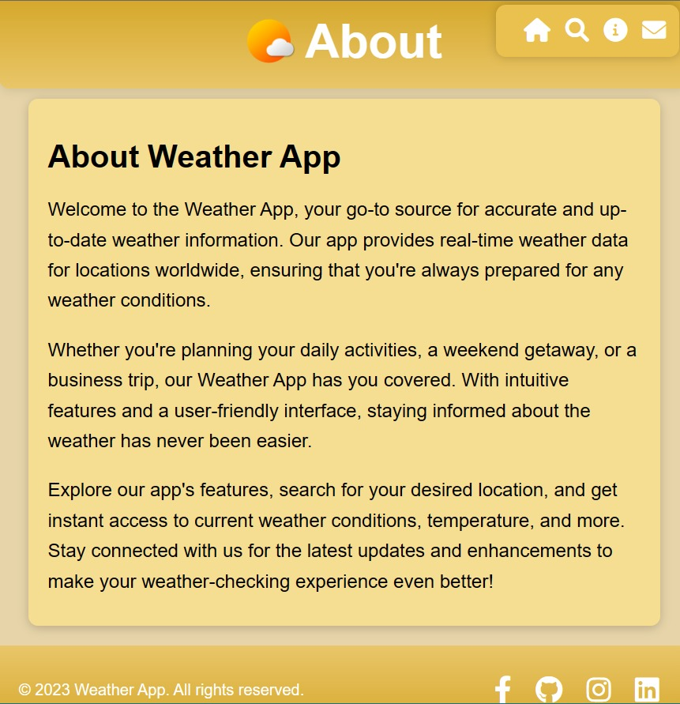
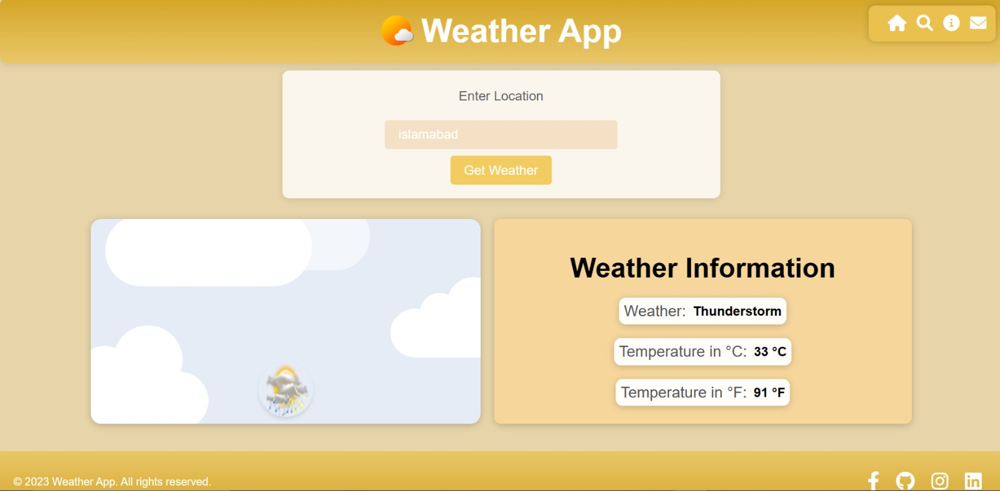

# Weather App 🌦️

Welcome to the Weather App, a simple and stylish web application that provides real-time weather information for your desired location. With a visually appealing interface and dynamic features, this app offers an engaging way to stay updated on weather conditions. 🌤️

## Features ✨

- 🏞️ User-friendly interface with an attractive design.
- 📱 Responsive layout for seamless usage on various devices.
- 🌍 Interactive form for inputting location preferences.
- 🌡️ Current weather details, including temperature (in Celsius and Fahrenheit) and weather conditions.
- 🌆 Day and night background images that adapt according to the time of day.
- ☀️ Dynamic weather icon that changes based on the current weather conditions.
- 📅 Social media links in the footer for connecting with the developer.

## Getting Started 🚀

1. Open the `index.html` file in your web browser.
2. Enter your desired location in the provided input field.
3. Click the "Get Weather" button to retrieve weather information for the chosen location.

## Dependencies 📦

- [FontAwesome](https://fontawesome.com/) - Icon library for navigation links.
- [AccuWeather API](https://developer.accuweather.com/) - Source of weather data based on location.

## How It Works ⚙️

1. Users input their desired location and click "Get Weather."
2. The app fetches location data using the AccuWeather API.
3. Upon successful location retrieval, the app fetches weather data for that location.
4. Displayed data includes weather text, temperature (Celsius and Fahrenheit), and a relevant weather icon.
5. The background image adjusts based on the current time of day (day/night).
6. Footer links provide avenues for connecting with the developer.

## Screenshots 📸

## Contact 📧

For any questions or feedback, please feel free to reach out to the developer:

- Email: [areebasattar23@gmail.com](mailto:areebasattar23@gmail.com)
- Facebook: [areeba.sattar.988](https://web.facebook.com/areeba.sattar.988/)
- GitHub: [AreebaSattar](https://github.com/AreebaSattar)
- Instagram: [ariba.s23](https://www.instagram.com/ariba.s23/)
- LinkedIn: [areeba-sattar](https://www.linkedin.com/in/areeba-sattar/)

## License 📄

© 2023 Weather App. All rights reserved.

## Acknowledgements 🙌

- Icon made by [dtafalonso](https://www.iconarchive.com/artist/dtafalonso.html) from [IconArchive](https://www.iconarchive.com/)
